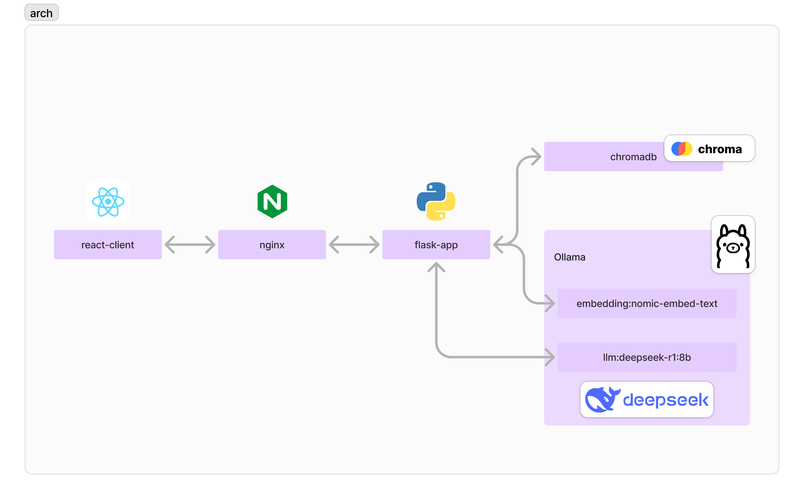
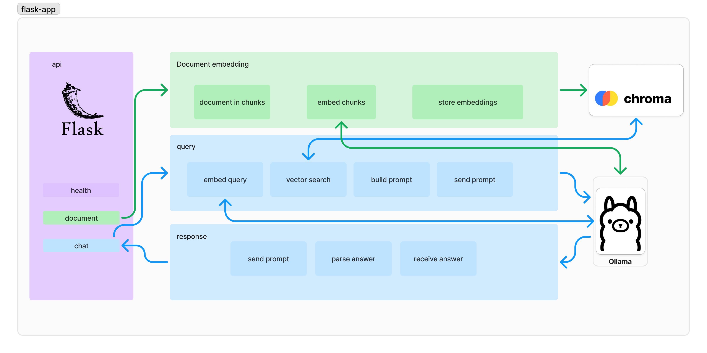

# RAG-DeepSeek


RAG-DeepSeek is a proof-of-concept application that demonstrates the integration of Retrieval-Augmented Generation (RAG) using a local DeepSeek model with Ollama. This project showcases how to combine document retrieval with large language models to provide accurate and contextually relevant responses.

<div align="center">
  
</div>

<div align="center">
  
</div>

## Features

- **Document Ingestion**: Supports multiple document formats (e.g., PDF) for building a knowledge base.
- **Intelligent Retrieval**: Utilizes vector databases to store and retrieve document embeddings efficiently.
- **Local LLM Support**: Runs entirely on your machine using Ollama, ensuring data privacy and offline capabilities.
- **DeepSeek Model**: Uses an open-source DeepSeek model available through Ollama for high-quality text generation.

## Prerequisites

Before setting up the project, ensure you have the following:

- **Python 3.7+**: The backend services are built using Python.
- **Node.js 14+**: Required for the frontend application.
- **Docker** (optional): For containerized deployment.

## Setting up Ollama in Docker

Create a volume to store the Ollama models:
This way, the models will persist even if the container is removed.

```bash
docker volume create ollama_vol
```

We don't have the models yet, we will setup our docker compose application first and then download the models.

```bash
docker compose up --build -d
```

This will start the Ollama server

Run the following command to download the models:

```bash
docker exec rag-deepseek-ollama-1 ollama pull deepseek-r1:7b
```

```bash
docker exec rag-deepseek-ollama-1 ollama pull nomic-embed-text
```

## Running the Application

Open the webbrowser and navigate to `http://localhost` to access the application.

Test the application
